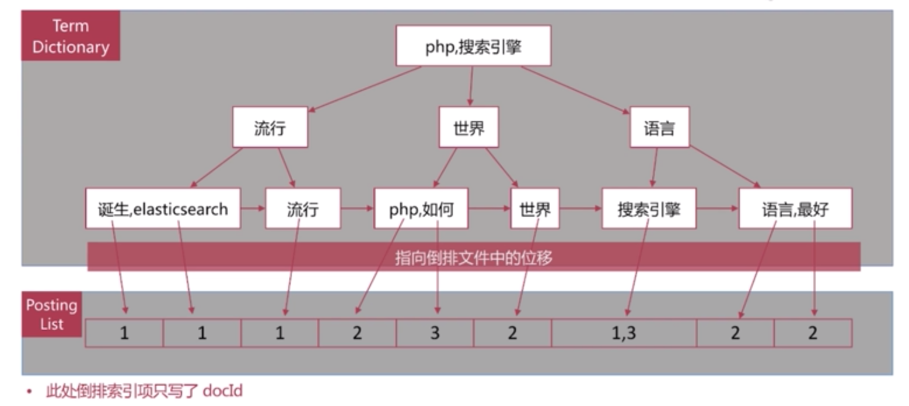

## 倒排索引
### 搜索引擎与书比较
- 目录页对应正排索引
- 索引页对应倒排索引

### 正排索引
> 文档 id 到文档内容、单词的关联关系

| 文档 ID | 文档内容 |
| --- | --- |
| 1 | elasticsearch 是最流行的搜索引擎 |
| 2 | pip 是世界上最好的语言 |
| 3 | 搜索引擎是如何诞生的 |

### 倒排索引
> 单词到文档 id 的关联关系

| 单词 | 文档 ID 列表 |
| --- | --- |
| elasticsearch | 1 |
| 流行 | 1 |
| 搜索引擎 | 1,3 |
| php | 2 |
| 世界 | 2 |
| 最好 | 2 |
| 语言 | 2 |
| 如何 | 3 |
| 诞生 | 3 |

#### 查询流程
eg: 查询包含”搜索引擎“的文档

- 通过倒排索引获得”搜搜引擎“对应的文档 id 有 1 和 3
- 通过正排索引查询 1 和 3 的完整内容
- 返回用户最终结果

#### 组成
> 倒排索引是搜搜引擎的核心

##### 单词词典（Term Dictionary）
> 是倒排索引的重要组成

- 记录所有文档的单词，一般都比较大
- 记录单词到倒排列表的关联信息
- 单词字典的实现一般是用 B+Tree

##### 倒排列表（Posting List）
> 记录了单词对应的文档集合，由倒排索引项（Posting）组成

- 倒排索引项（POsting）主要包含如下信息
    - 文档 id，用于获取原始信息
    - 单词频率（TF，Term Frequency），记录该单词在该文档中的出现次数，用于后续相关性算分
    - 位置（Position），记录单词正在文档中的分词位置（多个），用于做词语搜索（Phrase Query）
    - 偏移（Offset），记录单词在文档的开始和结束位置，用于做高亮显示

- 如何构建，以”搜索引擎“关键字为例

文档ID和文档内容关联表

| 文档ID | 文档内容 |
| --- | --- |
| 1 | elasticsearch 是最流行的搜索引擎 |
| 2 | php 是世界上最好的语言 |
| 3 | 搜索引擎是如何诞生的 |

"搜索引擎”关键字的倒排列表

| 文档ID | TF | Position | Offset |
| --- | --- | --- | --- |
| 1 | 1 | 2 | <18,22> |
| 3 | 1 | 0 | <0, 4> |

##### 单词字典与倒排列表整合在一起的结构

#### es 中的倒排索引

es 存储的是一个 json 格式的文档，其中包含多个字段，每个字段会有自己的倒排索引
